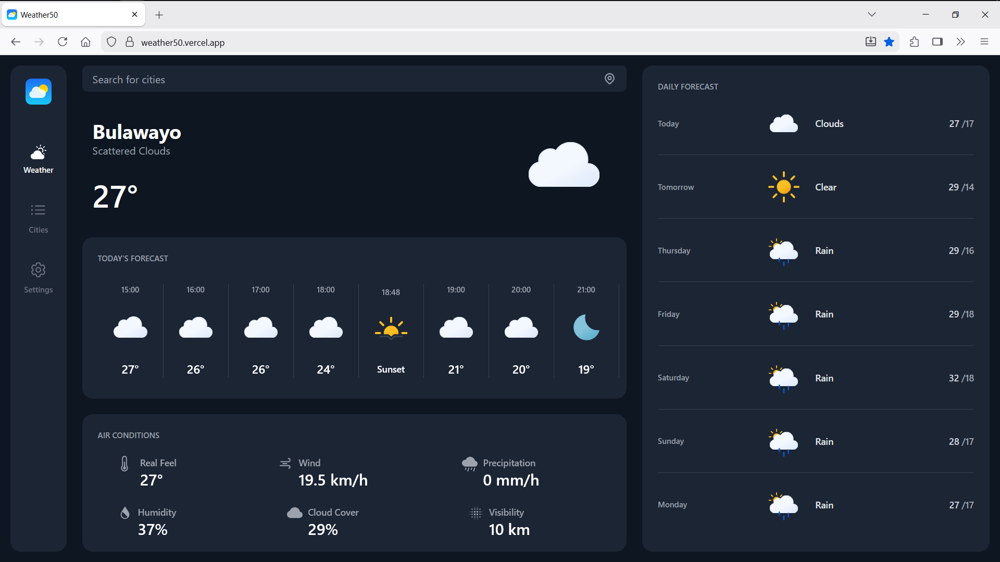
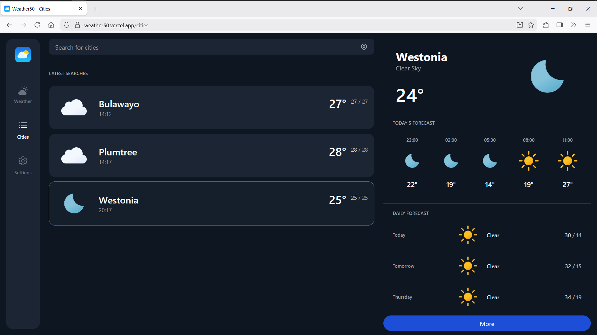
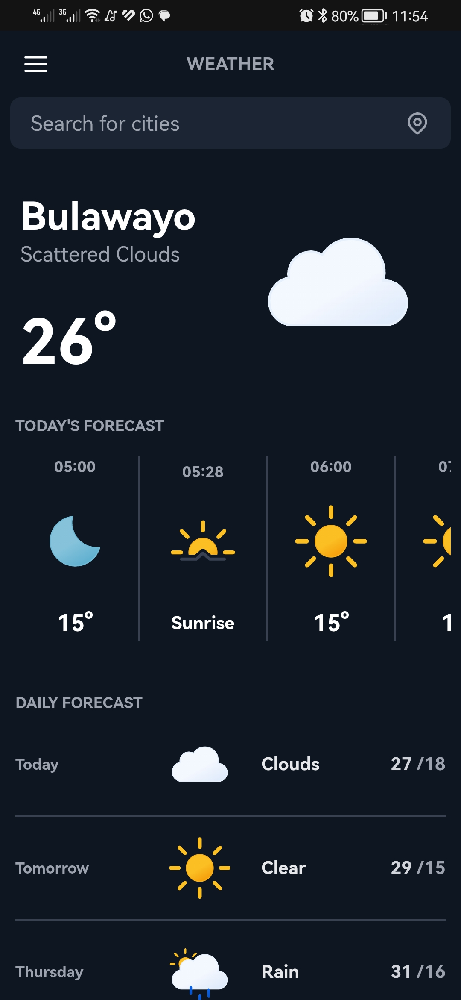
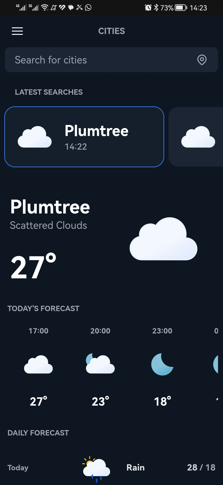
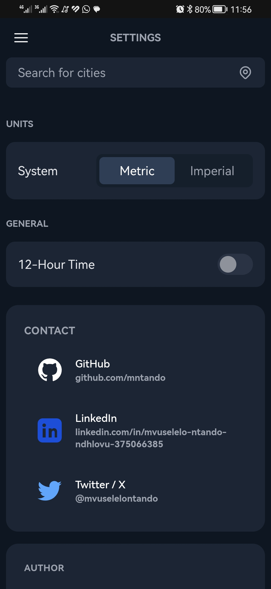

# weather50

**weather50** is a Flask-based weather web application built as a proof-of-concept and portfolio project.  
It provides current weather conditions and forecasts for major cities worldwide using the OpenWeatherMap API.

🔗 **Live demo**: https://weather50.vercel.app  

### Screenshots

  
  

  
  
  

---

## Features

- Current weather and forecast data
- City search backed by an SQLite database of major cities
- Stores up to **3 recently viewed cities** using Flask sessions
- Unit toggle between **Metric (°C)** and **Imperial (°F)**
- Simple backend & frontend in-memory caching
- Weather icons by **Basmilius**

---

## Tech Stack

### Frontend
- Tailwind CSS
- Vanilla JavaScript
- Deployed on **Vercel**

### Backend
- Flask (Python)
- OpenWeatherMap (OWM) API
- Flask sessions
- Simple in-memory caching
- Deployed on **Render**

### Database
- SQLite (stores major cities for search & autocomplete)

---

## Sessions & Preferences

- **Recent Cities**
  - Last 3 viewed cities stored per session
  - Displayed via the `/cities` route

- **Units**
  - Metric / Imperial preference stored per session
  - Configurable via Settings page

No authentication or persistent user accounts are used.

---

## Project Status

- ✅ Working proof-of-concept
- ✅ Built for portfolio demonstration
- ❌ Not production-ready
- ❌ No accounts

Possible future improvements:
- Persistent caching (e.g. Redis)
- IP-based location fallback
- Improved error handling
- Saved locations per user
- Licensing

---

## License

No license has been applied yet.  
Weather data provided by **OpenWeatherMap** (subject to their terms).

---

## Author

Built by **mv**  
https://mvfolio.vercel.app
